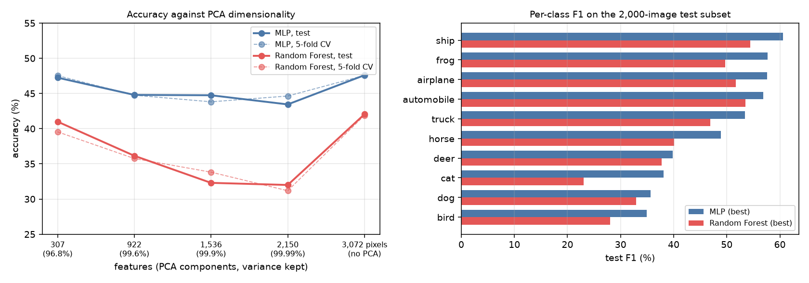

# CIFAR-10 Classical Machine Learning Benchmark

[](https://github.com/asher0913/cifar10-ml-benchmark/actions/workflows/ci.yml)


A reproducible benchmark for image classification without convolutional
networks. The pipeline flattens and standardizes CIFAR-10 images, builds PCA
representations, and compares a PyTorch multilayer perceptron with a
scikit-learn Random Forest under the same cross-validation and held-out test
protocol.

The workflow has three stages:

1) **PCA feature extraction** – Standardize flattened CIFAR-10 images and build PCA feature sets (10/30/50/70/100%).
2) **MLP experiments** – Train and evaluate a PyTorch MLP on all PCA feature sets (5-fold CV + test) and an MLP hyper-parameter sweep.
3) **Random Forest experiments** – Train and evaluate a Random Forest on all PCA feature sets (5-fold CV + test) and an RF hyper-parameter sweep.

All outputs are written under `outputs/` as CSV summaries, per-class JSON
reports, and plots. The default dataset cache is `data/`; torchvision downloads
the dataset automatically when it is not present.

## Results

A stratified 10,000-image training subset with 5-fold cross-validation, and an independent
2,000-image test subset. Pixels are scaled to [0, 1], flattened to 3,072 features and
standardised. The scaler and PCA are fitted on the training subset only, so the test subset never
influences them. The cross-validation folds share that one fit, which leaks slightly into CV but
not into test.



| Model | Best configuration | 5-fold CV accuracy | Test accuracy | Test macro F1 |
| --- | --- | ---: | ---: | ---: |
| MLP | 3,072 → 1024 → 512 → 10, dropout 0.3, learning rate 0.002, 80 epochs | 48.0% | **48.1%** | 48.3% |
| Random Forest | 600 trees, `min_samples_split=4` | 43.0% | **42.5%** | 41.8% |

- **307 PCA components are enough for the MLP.** They keep 96.8% of the variance, and the MLP
  scores 47.3% test accuracy on them against 47.6% on all 3,072 pixels, with a tenth of the
  input size. Cross-validation and test agree within about a point everywhere, so the ranking
  is not an artefact of the test subset.
- **PCA hurts the Random Forest as components are added.** Test accuracy falls from 41.0% at
  307 components to 32.3% at 1,536 and 32.0% at 2,150, then recovers to 42.1% on raw pixels. A
  likely reason: each split looks at √d randomly chosen features. Past the first few hundred
  components, almost every candidate is a near-zero-variance direction, whereas neighbouring raw
  pixels all carry some signal. The MLP weighs all inputs at once and is barely affected.
- **Both models fail the same way.** Vehicles, ships and frogs are easiest; cats, dogs and birds
  are hardest (MLP F1 38%, 36% and 35%). Without convolutions, neither model has any
  translation invariance, so the animal classes, whose pose and position vary most, suffer. On
  the full dataset a small CNN reaches well above 80%, which is the gap this benchmark
  illustrates.

<details>
<summary>All runs</summary>

| Features | MLP CV | MLP test | Random Forest CV | Random Forest test |
|---|---:|---:|---:|---:|
| 307 PCA components (96.8% variance) | 47.5% | 47.3% | 39.6% | 41.0% |
| 922 (99.6%) | 44.8% | 44.8% | 35.8% | 36.2% |
| 1,536 (99.9%) | 43.8% | 44.8% | 33.8% | 32.3% |
| 2,150 (99.99%) | 44.6% | 43.5% | 31.2% | 32.0% |
| 3,072 raw pixels | 47.6% | 47.6% | 41.9% | 42.1% |

The feature sweep uses the default MLP (512 → 256) and a 400-tree forest. Hyper-parameter
sweeps on raw pixels:

| MLP learning rate (1024 → 512, dropout 0.3) | CV | Test |
|---|---:|---:|
| 7e-4 | 47.4% | 46.1% |
| 1e-3 | 47.9% | 46.9% |
| 2e-3 | 48.0% | 48.1% |

| Random Forest | CV | Test |
|---|---:|---:|
| 200 trees, max depth 40 | 41.3% | 41.2% |
| 400 trees | 41.9% | 42.0% |
| 600 trees, `min_samples_split=4` | 43.0% | 42.5% |

Per-fold metrics, per-class reports and the original plots are in `outputs/`.
</details>

## Prerequisites
- Python 3.10+
- PyTorch; CUDA or Apple MPS is used for the MLP when available

Install dependencies:

```bash
python -m pip install -r requirements.txt
```

## How to run
Run the full benchmark with the default 10,000/2,000 subsets:

```bash
python main.py
```

Recommended for better MLP performance (full dataset + moderate network):

```bash
python main.py \
  --train-subset 0 --test-subset 0 \
  --mlp-hidden 1024 512 \
  --mlp-dropout 0.1 \
  --mlp-lr 0.001 \
  --mlp-epochs 220 --mlp-patience 35
```

Key CLI options (see `python main.py --help` for full list):
- `--data-root`, `--output-root`: dataset cache and output directories (defaults: `data`, `outputs`).
- `--train-subset`, `--test-subset`: set to `0` to use full CIFAR-10; otherwise number of samples.
- `--pca-targets`: PCA variance percentages (default `10 30 50 70 100`).
- MLP knobs: `--mlp-hidden`, `--mlp-lr`, `--mlp-dropout`, `--mlp-weight-decay`, `--mlp-batch-size`, `--mlp-epochs`, `--mlp-patience`, `--mlp-no-bn`, `--mlp-max-grad-norm`.
- RF knobs: `--rf-estimators`, `--rf-max-depth`, `--rf-min-split`, `--rf-min-leaf`, `--rf-max-features`, `--rf-max-samples`, `--rf-n-jobs`.
- `--skip-mlp`, `--skip-rf`: skip MLP or RF if needed.

## Outputs (under `outputs/`)
- `features/feature_metadata.json`: PCA feature dimensions & explained variance.
- `mlp/mlp_feature_sweep/` and `mlp/mlp_hparam_sweep/`: CV/test summaries (`summary.csv`), fold metrics, per-class JSON reports, plots.
- `random_forest/rf_feature_sweep/` and `random_forest/rf_hparam_sweep/`: same structure for Random Forest.

## Hardware note

The MLP uses CUDA or Apple MPS when available and falls back to the CPU, which is much slower
for the full sweep. The Random Forest runs on the CPU; `--skip-mlp` and `--skip-rf` run one side
only.
